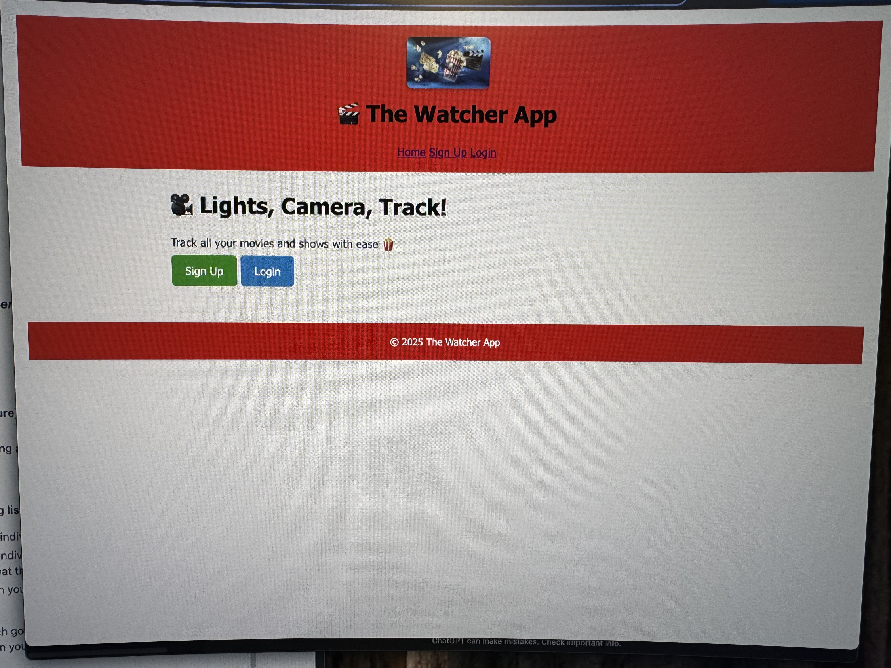

# 🎬 The Watcher App

## Overview

**The Watcher App** is a personal movie and TV tracker that allows users to:

- Add movies or shows they want to watch, are currently watching, or have watched
- Organize titles into categories: *Want to Watch*, *Watching*, *Watched*, and *Recommendations*
- Edit or delete entries they own
- Use session-based authentication to protect and personalize their list

This app was built as a final project for a MEN Stack (MongoDB, Express, Node.js) CRUD application with full authentication.

---

## 💻 Deployed App

🔗 [Live App] (https://thewatcher-app-0363df1d824a.herokuapp.com/)  
🔗 [GitHub Repo] (https://github.com/davolajohnson/thewatcher-app.git)  
📋 [Trello Board] (https://trello.com/b/liptz8cU)

---

## 🛠 Technologies Used

- JavaScript (Node.js)
- Express.js
- MongoDB & Mongoose
- EJS (Templating)
- HTML5 / CSS3 (Flexbox & Grid)
- express-session & bcrypt (for authentication)
- connect-mongo (for session storage)
- Git & GitHub (version control)
- Heroku (deployment)

---

## 🚀 Getting Started

### 1. Clone the Repo

git clone https://github.com/davolajohnson/thewatcher-app.git
cd thewatcher-app

2. Install dependencies:
   npm install

3. Set up your `.env`:
   MONGODB_URI=your-mongo-uri
   SESSION_SECRET=your-secret

4. Start the app:
   npm run dev

---

## 📌 Features

- Clean, responsive UI with a movie theme

- Full CRUD operations for watchlist items

- RESTful routing and MVC structure

- Authentication and authorization with sessions

- Pre-filled form fields when editing

- Styled buttons and accessible alt text on all images

---

## ✅ Next Steps

- Add support for uploading images/posters for each item

- Search or filter functionality

- Add user profiles with bio and favorites

- Public/shared recommendations between users

- Star ratings or comments

---

🙏 Attributions

- Logo created by user

- Unicode emojis for icons 🎥 🍿 🎬

- Layouts powered by Express-EJS-Layouts

- Fonts from Google Fonts (if added later)
---

## 📸 Screenshots

---

## 🗣️ Author

Built with ❤️ by Davola Stagg-Johnson
Final Project for General Assembly’s Software Engineering Bootcamp
---

© 2025 The Watcher App